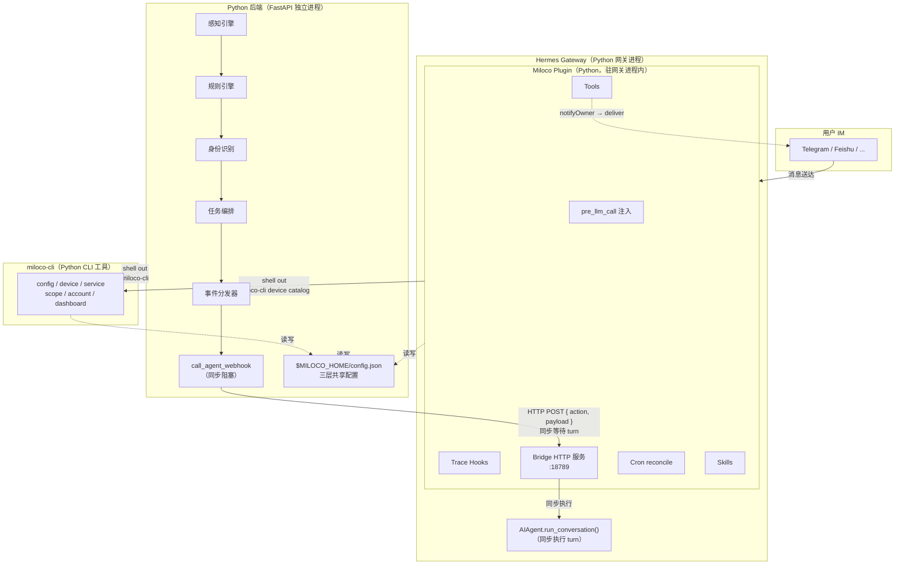
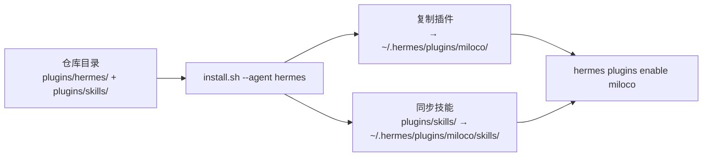

# Hermes Agent 集成

## 背景与目标

Miloco 原生基于 OpenClaw 框架做 Agent 集成。为了让同一套后端能力也能跑在 Hermes Agent 上，Miloco 提供了平行的 Hermes 插件（`plugins/hermes/`）。

Hermes 插件不是另起炉灶，而是复用同一套 Python 后端（`backend/`）与 `miloco-cli`（`cli/`），只在"网关侧适配层"做对应 Hermes 平台的实现。核心目标：**后端零改动**——webhook 协议、config.json schema、Skill 文档与 OpenClaw 完全一致，切换框架只改 config 中的 webhook 地址。

---

## 产品面

### 能做什么

与 [OpenClaw 集成](openclaw-integration.md) 的产品能力完全等价：自然语言控制设备、创建持久任务、主动感知回调、家庭记忆管理、后台知识整理、通知分发。差异只在运行时框架，不在用户可见能力。

### 典型场景

与 OpenClaw 一致——见 [OpenClaw 集成 · 典型场景](openclaw-integration.md#典型场景)。Hermes 侧区别仅在"Agent turn 由谁驱动"，对用户无感。

### 能力边界

- 插件运行在 Hermes Agent 网关进程内，注册 Hook / Tool / Skill / CLI 命令扩展其能力
- 后端回调通过插件自建的 HTTP bridge（非 Hermes 的 WebhookAdapter）接收，详见研发面
- Hermes 框架本身由小米 AI Agent 团队维护，框架问题（agent turn 失败、cron 不触发、plugin 加载失败）需向该团队反映
- 后端服务生命周期不自动托管：Hermes 无 `registerService` API，后端需由用户通过 systemd / launchd / 手动 `hermes miloco service restart` 启动

---

## 研发面

### 架构概览（数据流图）



与 OpenClaw 的核心差异：网关进程是 Python（而非 Node.js），turn 执行通过直接 import `AIAgent.run_conversation()`（而非插件 SDK 的 `subagent.run`），后端回调由自建 aiohttp HTTP 服务接收（而非 SDK 的 `registerHttpRoute`）。其余"薄适配层 + shell out 到 miloco-cli + 共享 config.json"原则一致，详见 [OpenClaw 集成 · 架构概览](openclaw-integration.md#架构概览数据流图)。

### 插件注册点全貌

插件入口：`plugins/hermes/__init__.py`。`register(ctx)` 按固定顺序注册各组件，顺序有隐含依赖：

| 扩展类型          | 实现文件                | 职责                                                                                                                                |
| ----------------- | ----------------------- | ----------------------------------------------------------------------------------------------------------------------------------- |
| **配置**          | `config.py`             | `$MILOCO_HOME` 路径解析（基于 `get_hermes_home()` 派生）、插件配置读取；`register` 最早期设入环境变量供子进程继承 |
| **Bridge**        | `bridge.py`             | 自建 aiohttp HTTP 服务（默认 `:18789`），接收后端 `{ action, payload }` POST，实现与 OpenClaw 一致的固定契约                       |
| **Agent Runner**  | `agent_runner.py`       | `AgentSessionPool`：按 session_key 缓存 / 复用 `AIAgent` 实例，`ThreadPoolExecutor` 同步执行 turn                                   |
| **Hook**         | `hooks.py`              | `pre_llm_call` 回调：Profile 分级判定 + 上下文文本组装（指令块 + 数据块），注入到 user message                                      |
| **Trace**         | `trace.py`              | turn trace 内存 buffer、GC 策略、debug gzip 落盘、`get_trace` 查询、traceId↔runId 关联                                              |
| **Tool**          | `tools.py`              | `miloco_im_push`（通知推送，通过 platform adapter 投递）、`miloco_habit_suggest`（防骚扰状态机） |
| **Tool**          | `suggestions.py`        | `miloco_habit_suggest` 防骚扰状态机（`threading.Lock` + 原子写）                                                                    |
| **数据获取**      | `catalog.py`            | 设备目录获取（`miloco-cli device catalog`，节流防抖），由 `hooks.py` 引用                                                          |
| **Cron**          | `cron_sync.py`          | cron job reconcile（仅创建缺失任务）                                                                     |
| **Skills**        | `skills_loader.py`      | 逐个 `ctx.register_skill()` 注册，命名空间 `miloco:<skill-name>`                                                        |
| **Schema**        | `schemas.py`            | 工具 JSON Schema 定义（OpenAI function-calling 格式）                                                                         |

注册顺序的隐含依赖：① config 先于一切（写盘副作用，后端 / bridge 需要正确的 webhook_url 和 auth_bearer）→ ② skills 先于 hooks（`pre_llm_call` 注入的指令引用 skill 名称）→ ③ hooks 先于 tools（trace hooks 需在工具执行前就位）→ ⑦ bridge 最后启动（确保 tools/hooks/skills 已注册后 bridge 才接收请求）。

### OpenClaw → Hermes 能力映射表

| OpenClaw (TS)                                  | Hermes (Python)                                                  | 关键差异                                                                                                  |
| ---------------------------------------------- | ---------------------------------------------------------------- | --------------------------------------------------------------------------------------------------------- |
| `api.registerService(backend)`                 | 进程级单例（`lazy_singleton`）+ `miloco-cli service restart`     | Hermes 无 `registerService`，服务生命周期不自动托管                                                       |
| `api.on("before_prompt_build")` → 注入 system prompt 头尾 | `ctx.register_hook("pre_llm_call")` → 注入 user message           | 注入位置不同，但模型同样可见；user message 注入保住 prompt cache 前缀                                     |
| `api.registerHttpRoute("/miloco/webhook")`     | **自建 aiohttp HTTP server**，直接 import `AIAgent.run_conversation()` | 与 Hermes `WebhookAdapter` 完全无关；是后端→插件的自定义同步 RPC 通道                                       |
| `api.runtime.subagent.run()` + `waitForRun()`  | `AIAgent()` 构造 + `ThreadPoolExecutor` + `run_conversation()`   | cron 系统的 `run_job()` 是最佳参考样例                                                                     |
| `api.registerTool(factory)` + TypeBox schema   | `ctx.register_tool(name, toolset, schema, handler)` + JSON Schema dict | 直接映射                                                                                                  |
| `api.on("gateway_start")` → cron reconcile      | `register(ctx)` 中一次性 reconcile + `ctx.register_cli_command`   | Hermes cron 存 `~/.hermes/cron/jobs.json`，格式不同；用系统时区                                           |
| trace hooks                        | `ctx.register_hook`（pre/post_tool_call, pre/post_llm_call, subagent_start/stop, on_session_start/end） | 事件名不同但语义等价                                                                                      |
| `contracts.skills: ["./skills"]`               | `ctx.register_skill(name, path)` 逐个注册                         | 插件 skill 只读，按 `miloco:skill-name` 命名空间访问，不出现在系统提示的 `<available_skills>` 索引中      |

### 关键设计决策

**为什么自建 HTTP bridge 而非用 Hermes WebhookAdapter**：Miloco 的 webhook 是后端→插件的自定义**同步 RPC**——后端 POST 一条消息后必须**阻塞等到 turn 完成**才能拿回 `{runId, status, error}` 做单飞调度和状态跟踪。Hermes 的 `WebhookAdapter` 是面向**异步外部事件**接入的，收到事件返回 202 即结束，不等待处理结果。语义完全不同，复用它会破坏后端 dispatcher 的调度前提。bridge 实现的是固定契约（请求/响应格式硬编码于 `utils/agent_client.py`），与 OpenClaw 插件的 `/miloco/webhook` 逐字段兼容，从而保证后端零改动。

**为什么直接 import `AIAgent.run_conversation()`**：这是 Hermes 所有前端（CLI / gateway / cron / delegate_task）共用的唯一同步入口，是官方稳定 API。cron 系统的 `run_job()` 已经是验证过的参考样例——构造 `AIAgent`、提交到 `ThreadPoolExecutor`、`future.result(timeout=...)` 同步等待。bridge 复刻同一模式，避免引入新的执行路径。`run_conversation()` 是同步阻塞函数，不能在 bridge 的 asyncio 事件循环线程中直接调用，必须用线程池包裹。

**为什么注入到 user message 而非 system prompt**：Hermes 的 `pre_llm_call` hook 把返回的 context 追加到 **user message** 末尾，而非改写 system prompt。OpenClaw 是改 system prompt 头尾，每轮都变。Hermes 这么设计的好处是 system prompt 跨轮稳定，保住 prompt cache 前缀（Anthropic / OpenRouter 可省可观的 input tokens）。语义等价——模型同样能看到全部上下文，只是注入位置不同。代价是注入是临时的 API 调用副本，不持久化到 session DB。

**为什么 `$MILOCO_HOME` 从 `get_hermes_home()` 派生**：不硬编码 `~/.hermes`，而是从 Hermes 官方的 `get_hermes_home()` 解析（尊重 `HERMES_HOME` 等自定义配置），再拼 `/miloco` 子目录。这样用户自定义了 Hermes Home 路径时，Miloco 数据自动跟随。`register(ctx)` 最早期调 `ensure_miloco_home_env()` 把解析结果写入 `os.environ`，确保后续 shell out 的后端 / CLI 子进程继承同一 `$MILOCO_HOME`，三层路径一致。

**为什么 Cron 用 Hermes 原生系统**：Hermes cron 是独立的、成熟的调度系统（`jobs.json` + 后台线程 `tick()`）。不自建调度器，遵循平台约定。`cron_sync.py` 在 `register(ctx)` 时做一次性 reconcile：检查受管 cron job 是否存在，缺失则创建，已存在则跳过。

### Skills 安装机制（安装脚本）

Hermes 的安装流程是 `git clone` + `shutil.move`，**没有构建步骤**，也没有 pre-install / post-install 钩子。`git clone` 获取的是仓库中已提交的文件，`.gitignore` 排除的文件不会出现在 clone 中。

方案：用 **统一安装脚本**（`scripts/install.sh --agent hermes`）一次性完成插件复制 + 技能同步。脚本从仓库目录运行（或自动 clone），将 `plugins/hermes/*.py` 复制到 `~/.hermes/plugins/miloco/`，同时将 `plugins/skills/` 同步到 `~/.hermes/plugins/miloco/skills/`，最后执行 `hermes plugins enable miloco`。`plugins/hermes/skills/` 被 `.gitignore` 排除，不在仓库中维护副本。



与 OpenClaw 的 `prebuild` 类比：OpenClaw 在**构建前**同步（skills 被 `.gitignore` 排除、不进仓库，发布到 npm 包里），Hermes 在**安装时**同步（安装脚本运行时直接从仓库读取源 skills 目录，无需维护副本）。

### 通知推送机制

通知通过 Hermes platform adapter 直接投递（如 Feishu、Telegram），不再依赖会话绑定。配置位于 Hermes `config.yaml` 的 `plugins.entries.miloco`：

```yaml
deliver: ""              # 推送平台，如 "feishu"、"telegram"，留空则不推送
deliver_extra:
  chat_id: ""            # 推送目标 chat_id，留空则使用 home channel
  message_thread_id: ""  # 消息线程 ID（如飞书话题），按需配置
```

投递优先级：`deliver` 非空 → 从 `GatewayRunner.adapters` 取对应平台 adapter → `deliver_extra.chat_id` 非空则使用，否则回退到 home channel。`deliver` 为空时通知仅记录日志不发送。

### 与其他模块的关系

与 [OpenClaw 集成 · 与其他模块的关系](openclaw-integration.md#与其他模块的关系) 完全一致：上游接收感知流水线 / 规则引擎 / 设备绑定的 `dispatch_event` 投递，下游通过 `miloco-*` Skill 操作设备、任务、家庭档案。差异仅在投递通道——OpenClaw 走 SDK 的 `registerHttpRoute`，Hermes 走自建 bridge，但两者实现的是同一份固定 webhook 契约。

### 配置共享

三端（backend / CLI / plugin）共用 `$MILOCO_HOME/config.json`，schema 与 OpenClaw **完全一致**，差异仅在默认值：

| 路径                | OpenClaw 默认值                       | Hermes 默认值                                  |
| ------------------- | ------------------------------------- | ---------------------------------------------- |
| `agent.webhook_url` | `${gatewayUrl}/miloco/webhook`        | `http://127.0.0.1:18789/miloco/webhook`（bridge 自建服务） |
| `agent.auth_bearer` | gateway auth token（框架认证解析写入） | `""`（bridge 默认不强制鉴权，本地信任）        |

用户从 OpenClaw 切换到 Hermes 时：设置 / 迁移 `$MILOCO_HOME`、改 `agent.webhook_url`、`hermes plugins enable miloco` 即可，后端代码无需任何修改。
