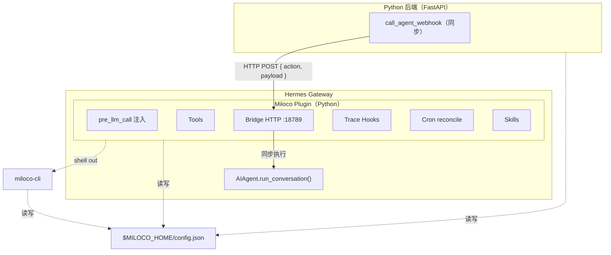

# Miloco Hermes Agent Plugin

Xiaomi Miloco 全屋智能方案——作为 Hermes Agent 插件运行。使用米家摄像头视频/音频作为全模态感知网关，MiMo 大模型作为智能大脑，编排全屋设备提供主动智能体验。

本插件是 [OpenClaw 插件](../openclaw/) 的平行实现，复用相同的 Python 后端（`backend/`）和 `miloco-cli`（`cli/`），仅适配层不同。

## 架构



**核心设计**：插件是薄适配层。重计算（感知、规则、身份）在后端，插件只做上下文注入、工具注册、webhook 转发、cron 调度。Bridge 直接 import Hermes 内部的 `AIAgent.run_conversation()` 同步执行 turn（参考 Hermes cron 系统的 `run_job()` 模式）。

## 安装

### 前置条件

- Hermes Agent 已安装并运行
- `miloco-cli` 已安装（与 OpenClaw 插件共用同一套 CLI/后端）
- Python ≥ 3.10

### 一键安装脚本（推荐）

使用统一的安装脚本，自动完成后端安装 + 插件复制 + 技能同步 + 插件启用：

```bash
curl -LsSf https://github.com/XiaoMi/xiaomi-miloco/releases/latest/download/install.sh | bash -s -- --agent hermes
```

或在仓库目录内：

```bash
bash scripts/install.sh --agent hermes
```

安装完成后重启网关：

```bash
hermes gateway restart
```

### 手动安装

```bash
# 1. 复制插件
cp -r plugins/hermes ~/.hermes/plugins/miloco

# 2. 同步技能（仓库内的技能源）
cp -r plugins/skills ~/.hermes/plugins/miloco/skills

# 3. 启用插件
hermes plugins enable miloco
```

### 重启 gateway

```bash
hermes gateway restart
```

### 配置后端 webhook 地址

本插件启动后会自动将 bridge 地址写入 `$MILOCO_HOME/config.json`。如果你从 OpenClaw 迁移，需更新后端指向：

```bash
miloco-cli config set agent.webhook_url http://127.0.0.1:18789/miloco/webhook
```

### 更新插件

重新运行安装脚本即可（会覆盖旧版本）：

```bash
bash scripts/install.sh --agent hermes
```

### 卸载插件

```bash
hermes plugins remove miloco
```

## 配置

在 Hermes 的 `config.yaml` 中配置插件：

```yaml
plugins:
  enabled:
    - miloco
  entries:
    miloco:
      bridge_host: "127.0.0.1"
      bridge_port: 18789
      bridge_auth_token: ""    # 空则不校验 Authorization 头
      bin_path: ""             # miloco-cli/miloco-backend 所在目录，留空则自动发现
      deliver: ""              # 通知推送平台，如 "feishu"、"telegram"，留空则不推送
      deliver_extra:
        chat_id: ""            # 推送目标 chat_id，留空则使用 home channel
        message_thread_id: ""  # 消息线程 ID（如飞书话题），按需配置
```

### `$MILOCO_HOME` 路径

`$MILOCO_HOME` 是三层共享配置目录：

1. `$MILOCO_HOME` 环境变量（优先）
2. `{HERMES_HOME}/miloco`（从 `get_hermes_home()` 派生，不硬编码 `~/.hermes`）

插件在 `register()` 时自动设置 `$MILOCO_HOME` 环境变量，确保 shell out 的后端/CLI 子进程继承同一路径。

## 模块说明

| 模块 | 职责 |
|------|------|
| `config.py` | `$MILOCO_HOME` 解析、插件配置读取 |
| `schemas.py` | 工具 JSON Schema |
| `suggestions.py` | 习惯建议防骚扰状态机 |
| `catalog.py` | 设备目录获取（5s 节流） |
| `trace.py` | Turn trace buffer + GC + gzip 落盘 |
| `hooks.py` | `pre_llm_call` 上下文注入（4 级 Profile） |
| `tools.py` | `miloco_im_push` / `miloco_habit_suggest` |
| `agent_runner.py` | `AgentSessionPool`（AIAgent 构造 + 复用） |
| `bridge.py` | Webhook bridge HTTP 服务（同步 RPC） |
| `cron_sync.py` | Cron job reconcile + `hermes miloco` CLI 命令 |
| `skills_loader.py` | Skills 注册 |

## 与 OpenClaw 插件的差异

| 特性 | OpenClaw | Hermes |
|------|---------|--------|
| 语言 | TypeScript | Python |
| 上下文注入 | system prompt 头尾 | user message（保住 prompt cache） |
| Webhook | `api.registerHttpRoute()` | 自建 aiohttp HTTP 服务 |
| Agent turn 执行 | `api.runtime.subagent.run()` + `waitForRun()` | `AIAgent.run_conversation()` + `ThreadPoolExecutor` |
| Cron | OpenClaw 网关 cron 系统 | Hermes cron（`~/.hermes/cron/jobs.json`） |
| Skills 访问 | `<skill-name>` | `miloco:<skill-name>`（命名空间隔离） |
| 后端管理 | `api.registerService()` | `hermes miloco restart` CLI 命令 |

## Webhook 契约

后端通过 HTTP POST 调用 bridge，协议是后端硬编码的固定契约：

**请求**：`POST http://127.0.0.1:18789/miloco/webhook`

```json
{ "action": "agent", "payload": { "message": "...", "sessionKey": "main", "traceId": "..." } }
```

**响应**：

```json
{ "code": 0, "message": "ok", "data": { "runId": "...", "status": "ok" } }
```

## 测试

```bash
cd plugins/hermes
python3 -m pytest tests/ -v
```

## 设计文档

- [OpenClaw 插件工作机制](../../docs/superpowers/specs/2026-06-19-openclaw-plugin-mechanics.md)
- [Hermes 插件设计文档](../../docs/superpowers/specs/2026-06-19-hermes-plugin-design.md)
